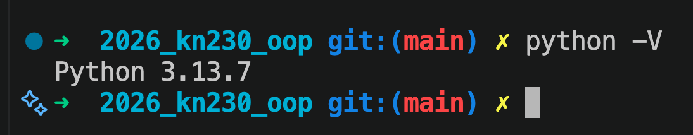

# Практикуємся з Markdown
Зміст (table of contents)  
[1](#робимо-структуру-з-розділів-та-підрозділів)  
[2](#підрозділ-3-рівня-з-списками)  
[3](#практикуємось-з-переходими-та-лінками)  

## Робимо структуру з розділів та підрозділів 
** Цей текст не буде відформатованим ** але **буде жирним** __Це також буле жирним__
*Це буде зкошений текст* так само як _це буде зкошений текст_
***Буде скошеним і жирним*** а також _**скошений і жирний**_

### Підрозділ 3 рівня з списками
- пункт перший
    * пункт другий
        + більше 3 рівнів вже складно робити

1. пункт перший
1. пункт другий
1. додали пункт після модифікації
1. пункт третій

## Практикуємось з переходими та лінками
[Це буде текст лінки](1.md)

## Вставляємо скріни
Інсталювали Python і зробили скріншот, як це виглядає на вашому комп'ютері.

[Повернутись до змісту](#практикуємся-з-markdown)  
[Повернутись на головну сторінку](../README.md)
