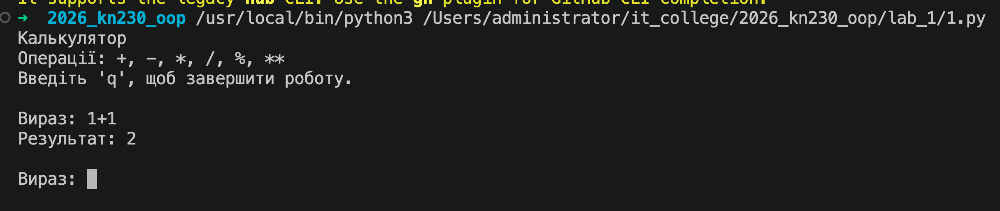

# Звіт до роботи № 1
## Тема: _Вступні заняття: налаштування середовища, початок роботи з Python та Markdown._
### Мета роботи: _налаштувати середовище роботи у VS Code, створити репозиторій GitHub та налаштувати інтеграцію з ним, написати першу програму на Python і створити звіт із використанням форматування Markdown._

---
### Виконання роботи
1. Створили репозиторій на GitHub та налаштували інтеграцію з VS Code. Створили папку `lab_1` та додали до неї файл `README.md` з описом роботи. Додали плагіни для роботи з Python та Markdown у VS Code.
2. Створили файл `1.py` з кодом першої програми на Python і навчились запускати її у VS Code - через кнопку Run, через термінал та через інтеграцію з Jupyter Notebook. Результат запуску програми на стріншоті нижче:
    
3. Створили файл `1.ipynb` з кодом першої програми. Запустили комірки та отримали результат виконання програми. Всі комірки виконані та [результат можна побачити у файлі `1.ipynb`](./1.ipynb). 

* результати виконання індивідуального завдання:
    - запустили всі програми та зробили скріншоти результатів виконання програм

---
### Висновок:
> у висновку потрібно відповісти на запитання:

- :question: Що зроблено в роботі: навчились створювати репозиторій на GitHub, налаштовувати інтеграцію з VS Code, створювати файли з кодом на Python та запускати їх у різних середовищах;
- :question: Чи досягнуто мети роботи: так, мету роботи досягнуто;
- :question: Які нові знання отримано: навчились працювати з GitHub, VS Code, Python та Markdown, робити звіт по шаблону Markdown, запускати програми на Python у різних середовищах, працювати в консолі.
- :question: Чи вдалось відповісти на всі питання задані в ході роботи: так, всі питання були розглянуті та відповіді на них надано у звіті;
- :question: Чи вдалося виконати всі завдання: так, всі завдання виконано;
- :question: Чи виникли складності у виконанні завдання: ні, складнощів не виникло;
- :question: Чи подобається такий формат здачі роботи (Feedback): так, формат здачі роботи відповідає очікуванням;
- :question: Побажання для покращення (Suggestions);

---